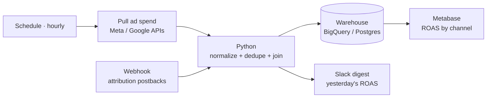

# Demo 01 — Marketing Attribution Pipeline

**Stack:** n8n · Python · SQL (warehouse) · Metabase
**Type:** Self-built demonstration with synthetic data.

> A representative build of an automated pipeline that pulls ad-platform and
> analytics events, normalizes them, and lands clean ROAS-by-channel data in a
> warehouse — replacing the manual CSV export grind. Built to show architecture
> and execution; the data here is fabricated.

---

## The Challenge

A growth team runs paid acquisition across Meta, Google, and a mobile-attribution
provider (e.g. AppsFlyer-style postbacks). Reporting depends on someone manually
exporting CSVs from each platform every morning, pasting them into a sheet, and
reconciling spend against conversions. The result:

- **~10 hours/week** of manual exporting and cleanup.
- **24–48h data latency** — decisions are made on stale numbers.
- **Attribution drift** — channels are double-counted or dropped, so ROAS is wrong.

## The Architecture



**Decisions & rationale**
- **n8n** orchestrates: one scheduled branch pulls spend from ad APIs; one webhook
  branch receives attribution postbacks in near-real-time. Keeps batch and stream
  in one workflow.
- **A Python step** does the real work — normalizing each platform's schema into a
  single event shape, de-duplicating by event id, and joining spend to conversions
  by `(channel, campaign, date)`. (See [`transform.py`](./transform.py).)
- **Warehouse** is the single source of truth; Metabase reads from it so the
  dashboard is always live, not a re-pasted snapshot.
- A **Slack digest** posts yesterday's ROAS each morning so the team sees movement
  without opening a dashboard.

## The Deliverable

- [`workflow.n8n.json`](./workflow.n8n.json) — importable n8n workflow (schedule +
  webhook → code → warehouse → Slack).
- [`transform.py`](./transform.py) — the normalization + ROAS logic. **Runnable as-is
  with the bundled synthetic data** (`python transform.py`).
- This case study + the diagram above.

Sample output (`python transform.py`):

```
# ingested 333 postbacks, 332 after de-dup
channel      spend   revenue  conversions   ROAS
google      980.00   3724.00          133   3.80
meta       1200.00   4680.00          156   3.90
referral      0.00   1290.00           43    n/a
```

## The Outcome (modeled)

- Manual export time: **~10 hrs/week → 0.**
- Data latency: **24–48h → near-real-time.**
- One consistent attribution definition → ROAS the team can actually trust and act on.
