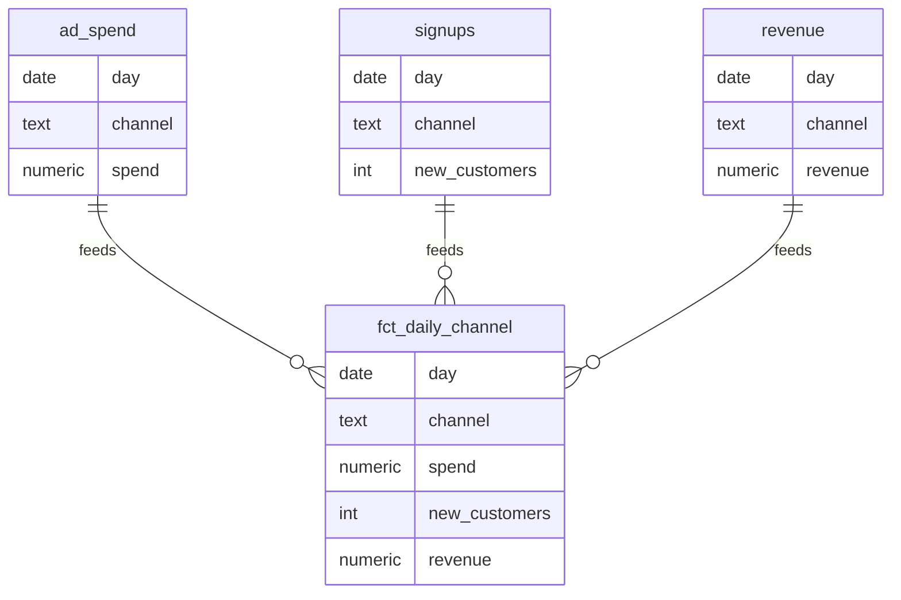

# Demo 03 — RevOps KPI Model + Dashboard

**Stack:** SQL · Metabase (or DOMO) · a warehouse (Postgres/BigQuery)
**Type:** Self-built demonstration with a synthetic schema.

> A representative data model + the SQL behind a CAC / ROAS / LTV dashboard a growth
> lead can actually trust — clear definitions, one source of truth, no re-pulling.
> Schema and queries are real and run on any Postgres; numbers are illustrative.

---

## The Challenge

Marketing spend, signups, and revenue live in three different tools. Every exec asks
"what's our CAC?" and gets three different answers because nobody agrees on the
definitions or the join logic. Dashboards get rebuilt ad hoc and trusted by no one.

## The Model

A small, well-defined star schema is the fix — one definition of channel, spend,
and revenue, joined consistently.

The grain is one row per `(day, channel)`. Every KPI (CAC, ROAS, blended LTV) is
derived from this one fact table, so the numbers reconcile everywhere.

## The Deliverable

- [`queries.sql`](./queries.sql) — the build of `fct_daily_channel` plus the exact
  CAC / ROAS / LTV / payback queries that power each dashboard tile. Standard SQL;
  runs on Postgres.
- This case study + the model diagram.

**KPIs defined (no ambiguity):**

| Metric | Definition |
|--------|------------|
| CAC | `spend / NULLIF(new_customers, 0)` per channel |
| ROAS | `revenue / NULLIF(spend, 0)` per channel |
| Blended LTV | trailing per-customer revenue over the cohort window |
| Payback | `CAC / (LTV / months)` — months to recover acquisition cost |

## Dashboard layout (Metabase)

1. **Top row** — blended CAC, ROAS, LTV:CAC ratio (single-number tiles).
2. **Trend** — daily ROAS by channel (line).
3. **Table** — channel leaderboard: spend, customers, CAC, ROAS, payback, sorted by ROAS.
4. **Alert** — Metabase pulse: ping Slack if any channel's CAC rises >20% week-over-week.

## The Outcome (modeled)

- One agreed definition of CAC/ROAS → execs stop arguing about whose number is right.
- Self-serve dashboard → no more ad-hoc rebuilds.
- Channel leaderboard makes reallocating spend toward the best ROAS obvious.
