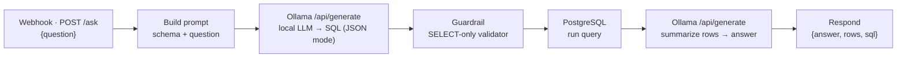

# Demo 04 — Local-AI Data Assistant (chat with your data, zero cloud)

**Stack:** n8n · Ollama (local LLM) · PostgreSQL
**Type:** Self-built demonstration with synthetic data.

> A representative build of a private "ask your business anything" assistant: a
> plain-English question goes in, a local LLM translates it to SQL against a sales
> database, and the answer comes back summarized with the numbers. No cloud API is
> involved at any step — the pattern for companies whose data cannot leave the network.
> Modeled on a production system I run; all data here is fabricated.

---

## The Challenge

The data exists, but answers require SQL or a ticket to the data team. And the obvious
shortcut — pointing a cloud chatbot at company data — is a non-starter for anything
involving revenue or leads. Teams want self-serve answers **and** zero data egress.

## The Architecture

Two model calls, deliberately: the first only writes SQL (constrained to JSON output),
the second only narrates the result rows. Splitting the jobs keeps small local models
reliable.

**Guardrails that make it production-shaped:**
- The generated SQL passes a validator: `SELECT`-only, single statement, no DDL/DML —
  the LLM literally cannot write to the database.
- The DB connection uses a read-only role (see `schema.sql`).
- The response includes the SQL it ran — every answer is auditable.

## Files

| File | What it is |
|---|---|
| `workflow.n8n.json` | The n8n workflow (core nodes only — portable across n8n versions) |
| `schema.sql` | Synthetic sales schema + seed data + the read-only role |

## Run it

1. `ollama pull qwen2.5:7b` (any instruct model works; edit the model name in the two HTTP nodes)
2. Load `schema.sql` into Postgres
3. Import `workflow.n8n.json` into n8n, point the Postgres credential at your DB (read-only role)
4. `curl -X POST <webhook-url>/ask -d '{"question":"revenue for Spring Promo, paid search only, last 4 weeks?"}'`

> n8n's native Chat Trigger + AI Agent nodes can replace the webhook front-end for a
> built-in chat UI; this demo sticks to core nodes so it imports cleanly anywhere.

## Where this goes in production

The production version of this pattern adds: AI pre-labeling of incoming leads
(classify-on-arrival, so reps see the strongest leads first), a knowledge-base tool for
non-SQL questions, and scheduled ETL feeding the database — all orchestrated in the same
n8n instance. See the case study on the portfolio site.
